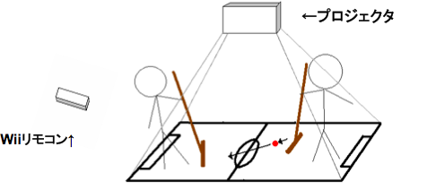
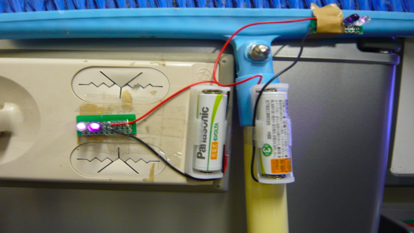

# Wiiリモコンを用いたほうきホッケーゲーム

WiiリモコンをBluetooth経由でパソコンに接続して何か作ろう！ということで作品を作ってもらう演習を行いました。

このあたりからProcessingを活用するようになりました。

構成は以下のような感じでした。

残念ながらプレイ動画が残っていなかったので。。。ほうきに赤外線LED（Wiiのセンサーバーに相当する）を実装しているところが以下です。

