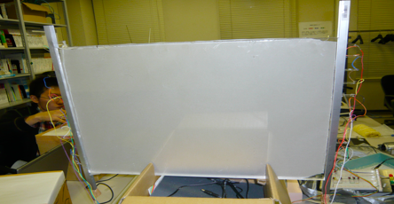
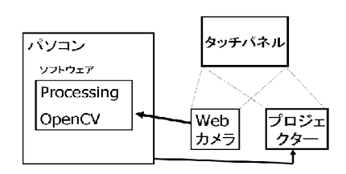

# マルチタッチディスプレイとソフトウェア製作

スマホが当たり前の時代ではマルチタッチディスプレイは当然の存在になりましたが、当時はATMのようなシングルタッチディスプレイはあってもマルチは少なかった時代でした。

その時代に[Jeff Han氏のTEDの動画を見て](https://www.ted.com/talks/jeff_han_the_radical_promise_of_the_multi_touch_interface)、ぜひ学生さんに作ってもらいたいと始めたプロジェクトでした。

製作したディスプレイは以下です。

構成は以下のようになります。

以下が成果物です。よくできたと思います。

