# enchant.jsを用いたスマホゲームプログラミング演習

HTML5とJavascriptを用いたゲームプログラミング演習を行いました。前期に持ち回りで講義をして、後期に自分で企画したゲームを製作し、ゲーム共有サイトである9leapにアップロードして評価を得るまでを行いました。

使用した教科書は「ゼロからはじめるenchant.js入門」でした。

残念ながらUEIが倒産？し、9leap.netが失効したようで、以下のゲームはすべてアクセスができなくなっていました。とりあえずInternet Archiveからゲームタイトルなどを救済しました。ローカルで動作するようにソース取っておけばよかったなぁ。。。残念。

## 2012年度の作品

[くまさん避けてぇ！](https://web.archive.org/web/20170914070332/http://9leap.net/games/2380/)
- 制限時間60秒！くまに攻撃方法など無い！避けて避けて避けまくれ！
- 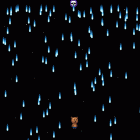

[絵合わせパズル](https://web.archive.org/web/20170914070332/http://9leap.net/games/2481/)
- バラバラになっている絵のパネルを入れ替えていくことで画像の完成を目指そう！
- 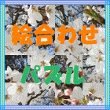

[くまくまRPG](https://web.archive.org/web/20170914070332/http://9leap.net/games/2428/)
- 1分で終わる物語「くまくまRPG」クマがくまっているので、クマとパートナーになって助けてあげてください。クマとの好感度によりエンディングが変化すぞ!！
- 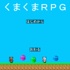

[shot・bar](https://web.archive.org/web/20170914070332/http://9leap.net/games/2613/) 
- ハンドガンとサブマシンガンを使い分けて、バーのボトルをいち早く撃て!!
- UEI賞を頂き彼はMacBookを賞品としていただいた記憶があります。
- 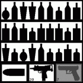

[ニコ厨叩き](https://web.archive.org/web/20170914070332/http://9leap.net/games/2438/)
- モグラ叩きの亜種です。ネットにはびこるニコ厨を叩くだけのシンプルなゲームです。結構な連打力が必要になります。制限時間内にできるだけ多く叩いてください。最後の約５秒はキャラクターが大量発生します。目指せランク「ニコ厨」！
- 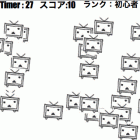

## 2013年度の作品

[RectMusic](https://web.archive.org/web/20170914070332/http://9leap.net/games/3662/)
- BGMに合わせて落ちてくるオブジェクトが、下2段のタッチゾーンにぶつかった辺りでタッチorクリックしてください。オブジェクトをタッチしたタイミングによって入る点数が変わります。
- 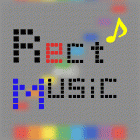

[Zombies & Monsters](https://web.archive.org/web/20170914070332/http://9leap.net/games/3693/)
- ゾンビやモンスターから逃げて、ゴールを目指します。体力や時間、お金、進行度によってスコアが変化します。難易度は難しく設定しているので、頑張ってゴールしてみてください！！
- 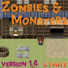
- こちらの作品は2013年度9leap後期優秀作品に選ばれました。夏休みを費やして作り込んだ感動作品でした。素晴らしい。[受賞記事がアスキーのサイト](https://weekly.ascii.jp/elem/000/002/621/2621050/?r=1)にまだありました。

[Tanker](https://web.archive.org/web/20170914070332/http://9leap.net/games/3676/)
- 戦車を操作して、スライムを倒そう！スコアが戦車のライフになる。戦車は敵に当たったり、動くだけでもスコアが減っていく。できるだけ動かずに、敵を倒していこう！！
- 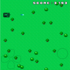

[ムーンウォークベアー](https://web.archive.org/web/20170914070332/http://9leap.net/games/3664/)
- しろくまだよ。むーんうぉーくをするけど、ふつうにあるくよ。落ちてくるフルーツたちを白熊を操作して拾っていくゲームです。
- 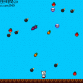

[jamming shooting](https://web.archive.org/web/20170914070332/http://9leap.net/games/3716/)
- 妨害電波で敵を味方に寝返らせて打ち合うシューティングゲームです。
タッチするとその場所に自機は移動し、離すと電波が円形に放たれます。
電波の届く範囲はタッチしていた時間に応じて広くなります。電波を放つたびにその時点の味方は全てリセットされます。味方が敵を倒すとスコアが上がり、一定時間内に連続で倒すとスコアが大きく上がります。
一定のスコアを取るとクリアです。
- 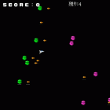

## 2014年度の作品

[遊覧飛行ゲーム](https://web.archive.org/web/20170914070332/http://9leap.net/games/4463/)
- 「xキー」又は、画面をクリック中だけ、ヘリが上昇します。ルール：ライフが０になると、ゲームオーバーです。
- 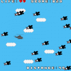

[タワーディフェンス](https://web.archive.org/web/20170914070332/http://9leap.net/games/4446/)
- クリスタルに向かって進行してくる敵を倒しクリスタルを守る、オーソドックスなタワーディフェンスゲームです。
- 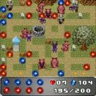
