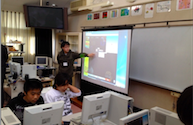

# コロコロ工作ブロックを用いたゲームプログラミング教室

enchant.jsつながりで知ったコロコロ工作ブロックを利用して、2013年、2014年と２年続けて、大学生による小学生を対象としたゲームプログラミング教室を開催してきました。

桂川町の桂川小学校、桂川東小学校にご協力していただいて授業させていただきました。

小学生が飽きずに楽しめるような授業計画を立てることはいい経験だったようです。

