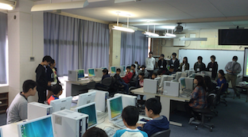

# Scratchプログラミング授業開催

今年も桂川小学校様、桂川東小学校様にご協力いただきまして、情報学科１年生によるプログラミング授業開催ができました。

今年で３年目の開催になります。

一昨年、昨年はコロコロ工作ブロック、今年はScratchで授業をしてもらいました。

講師役となった１年生はまさにプログラミングを学習中の身ですが、人に教えることで自分も学べるはずという思いのもと実施させていただいています。

学生にどれほどの影響があるのかわかりませんが、参加した学生の多くはやってよかったと思っているようですし、小学校様からは生徒が楽しそうに学んでいたと評価していただいています。

詳細は[個人ブログ](http://memorandums.hatenablog.com/entry/2015/12/01/191518)に書いています。よろしければご覧ください。

