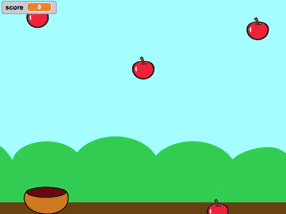

# Scratchのプログラミング授業

今年度も桂川小学校でScratchのプログラミング授業を開催させていただきました。６年１組の担任の先生、生徒の皆さん、ありがとうございました。

これまで後期の基礎ゼミIIという科目で実施してきましたが、今年度、情報学科のカリキュラムが変更となり時間割がずれた影響で前期の開催となりました。

これまでは小学校の部活動（パソコン部）の１コマをお借りしての実施でしたが、大学生の時間割の空き時間の関係で曜日があわず、授業時間（５校時、６校時）をお借りしての実施となりました。関係者の皆様には調整に際していろいろとご迷惑をおかけしました。申し訳ありませんでした。

授業内容は学生の発案でScratchの公式サイトの右横に表示されるCatch Gameを日本語訳したものを題材としました。以下のようなゲームです。

５校時は大学生のリードにしたがって一通り一緒に進めてゲームを完成させました。６校時には大学生のサポートのもと各自で拡張にチャレンジしてもらいました。毒りんごを追加したりキャラクターを変更したりスピードアップしたり様々な作品ができました。

授業の様子は以下のような感じです。

これまで４年間にわたって実施してきました。

プログラミング教育は関心はありますが研究や論文までは昇華していません。あくまで地域貢献、ITに関心をもってもらう機会作り、あとは大学生に教える楽しさを知ってもらいたく実施してきました。

これもイチ大学教員が考えただけでは実施は無理です。学校で開催する場合は教育委員会への届け出は必要ですし、当然、開催校の多大な協力なくしては実施は不可能です。

大学の時間割は私一人の都合では決められませんので、このままであればこの形式での今後の継続は難しいと思います。夏休みなどにサマースクールやイベントでの開催という形にしていくしかないな。。。と思う次第です。

最後になりましたが、指導にあたってこれまで準備を進めてきてくれた大学生の皆さん、お疲れでした。今年度は授業中に授業のシミュレーションまでして本番を迎えることができました。皆さんが目にした通り、授業は大成功だったと思います。少々複雑な手順もありましたが、生徒さんたちは本当に楽しんで受講していました。卒業まであと３年半もありますので、今回の経験を何かに活かしてくれたらと思います。
