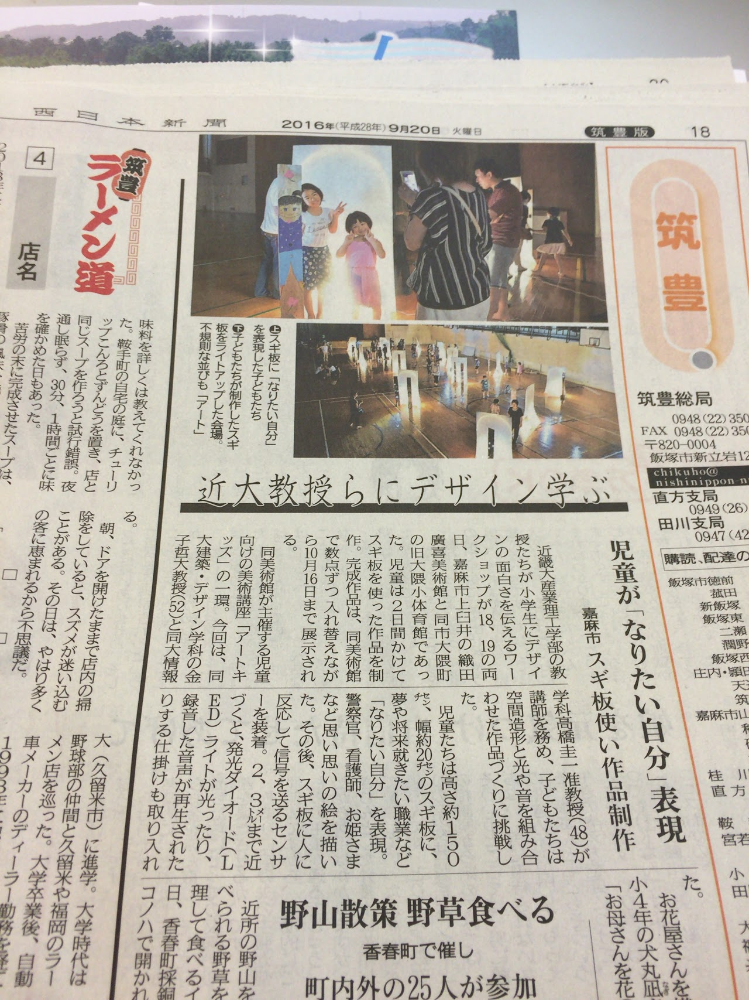
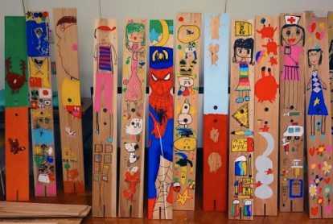
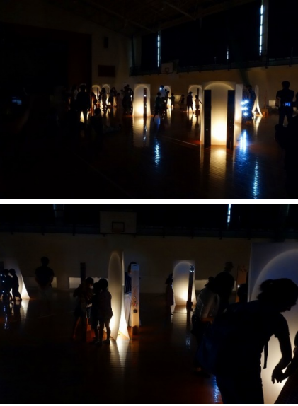

# 美術講座「アートキッズ」

織田廣喜美術館の美術講座「アートキッズ」に講師として参加しました。建築デザイン学科の金子先生からお声かけいただきまして初参加でした。

杉板になりたい自分をデザインして、そこに人が近づいたら音声が再生する装置を取り付けるというものでした。

台風が接近する中、開催が危ぶまれましたが、２日間にわたって開催しみんな思い思いの作品を完成できました。

そのときの様子は西日本新聞に掲載されました。

