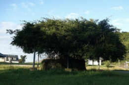
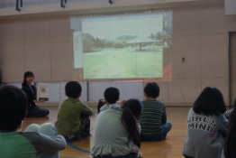
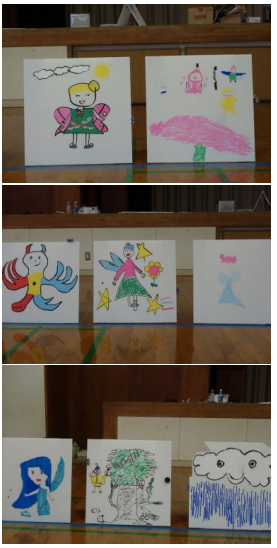
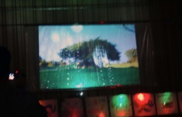
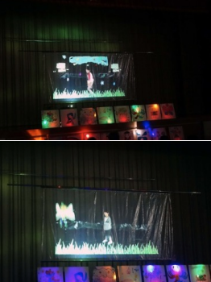

# 織田廣喜美術館・教育イベント（大学生のお兄さん、お姉さんと一緒に作ろう！！ ）

美術館横には、大きな藤の木があります。その藤の木には、仲よしの妖精がいたのですが、その妖精がいなくなってしまったそう。だから、みんなで妖精を作ってあげて、藤の木を元気にしよう!というこの企画でした。

参加者が描いた妖精たちです。

作った妖精についてプレゼンしてもらいました。

参加者の妖精が放たれると木が活性化していくようにしました。Processingで色付けして。

最後に参加者が踊っている様子を学生くんらが可愛い動画にしてくれてその鑑賞会になりました。

素晴らしいイベントになったと思います。