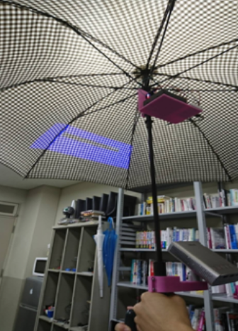

# 情報学プロジェクト2017

今年度のテーマは「ウェラブルデバイス開発」でした。

当ゼミに3Dプリンタ、レーザーカッターを導入しファブ環境が整いつつありましたが、卒業研究以外の通常の授業で使用することがありませんでした。少人数ではありますが、それらの使い方を学びつつ、自分らが企画したデバイスを作って欲しいというアイデアから生まれたテーマでした。

２人ずつ４チームで企画から学習・制作までを１年間（３０✕９０分）でこなした作品です。

中身も見た目もショボいですが。。。卒業研究の前に、自分らで考えたアイデアを形にするというのは勉強になったのではないかと思います。

 
## ニオイ検査ウォッチ
最初に最もうまくできたと思う作品です。同県の北九州高専のベンチャーが開発した「はなちゃん」が話題になりましたが、一応、これはそれを知らずに着手したものでした。あとあと文献を参考にしましたのでオリジナルではありませんが。実用性は別としてとりあえずウェラブルデバイスとして形になった作品と思います。

## 自動ドアのセンシング範囲をシンプルに拡張するデバイス
イベント会場などでたくさんの人の往来がある場所では自動ドアを早めに開けてあげると効率的になるのではないか。。。という発想からの開発でした。機構はいたって簡単で、超音波センサーで人の接近を検知したら、サーボモーターを駆動して、本物の自動ドアのセンサーを遮光します。

## 腕立てカウンタ
このチームはいろいろとアイデアがあったものの、うまくまとまらず。。。Qiitaか何かで紹介されていた同名のシステムを真似て作ってみたシステムでした。デモしている学生さんがトレーニング好きということで個人的な必要性から開発したものでした。仰ぐウチワロボット？は愛嬌ということで。。。

## 夜道を楽しく歩くためのアンブレラシアター
これは残念ながら動画がありませんがシステムはしっかり完成していました。スマホを接続したミニプロジェクターの映像を傘に投影し、Arduinoに取り付けた加速度センサーで傘の傾きを検知して動画の再生・停止をコントロールできます。ArduinoはWifi接続に対応したUNOを使用し、HTMLクライアントとのやりとりをする部分は私も開発した経験がなかったので勉強になりました。

