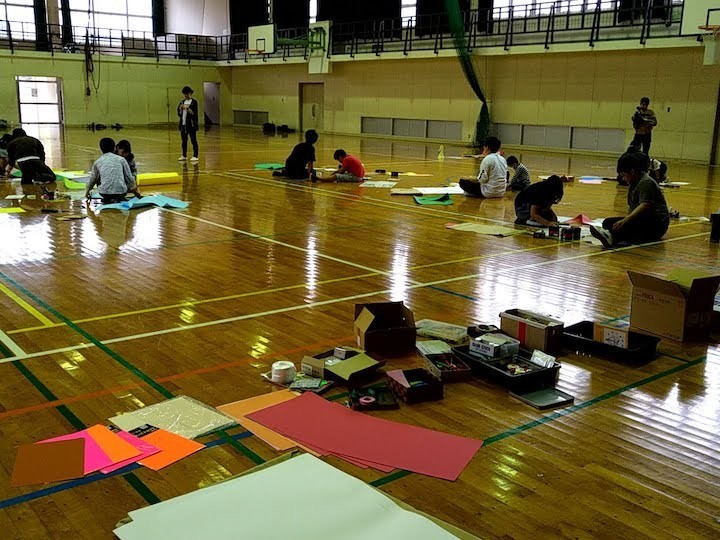

# 織田廣喜美術館・教育イベント（ようこそ、ぼくらのKAMA妖怪大図鑑へ ）

小学生が嘉麻市に伝わる河童や皿屋敷などの不思議な伝説をモチーフに、妖怪や幽霊を米袋にデザインし、扮したりするなどデザインを通じて地域活性化の活動を行います。

また、小学生が妖怪や幽霊に扮した姿を写真に撮り、「のぞき箱」に収めると、妖怪の世界に入り込んだ姿を見ることができます。

[個人ブログに振り返り](https://memorandums.hatenablog.com/entry/2019/10/15/082915)を書きました。詳しくはそちらをどうぞ。

