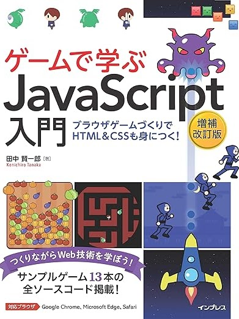

# 情報学序論2023

２年後期授業で[ゲームで学ぶJavaScript入門（B0BPKWRT29）](https://book.impress.co.jp/books/1122101041)を各自のペースで学習しながら、わからないところを聞いてもらうスタイルで演習しました。

プログラミングの基礎は「教えてもらう」必要があると思いますが、基礎を習ったあとは自分の興味に応じて学習することで知識と経験を深められると考えています。

自分のペースで、自分の理解の仕方で理解する、わからないときにはすぐに手助けできるサポーターがいる、そういう環境がプログラミングの上達には重要と考えています。

授業の最後の３回で掲載ゲームを改変してオリジナルゲームの制作してもらいました。

以下の動画は最終回にそれぞれに制作したゲームを紹介してもらいました。カメラ（DJI osmo）の調子が悪くピンボケしている動画もありますがご容赦ください。

