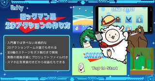

# 情報学序論2025

２年後期授業でUnityアプリ開発者でもあるUnityの森さんが開発された教材[Unity 2Dアクションの作り方 ロックマン風横スクロールアクションゲームを作る](https://feynman.co.jp/unityforest/game-create-lesson/2d-action-game/)を使ってUnityアプリ開発のゼミを行いました。

教材はUnityの初心者にはちょっと難しい（Unityの操作などの説明がない）という意見がありましたのと、やはり本格的なゲームを開発する大変さがよくわかる教材になっていました。

Unity学習本は数ありますが、その辺の厳しさ？を体感できる本はなかなかないと思います。

授業の最後の４回で掲載ゲームを学習したことを下地としてオリジナルゲームの制作にチャレンジしてもらいました。

以下の動画は最終回にそれぞれに制作したゲームを紹介してもらいました。ちなみにテーマは「ワンボタン」でした。教材を越えて開発した人が多くやる気を感じました。ぜひご覧ください。

