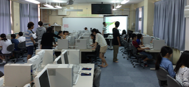

研究以外の本研究室の活動を紹介します。本学科では卒業研究配属前に各ゼミにわかれて活動する少人数授業があります。１年次には基礎ゼミ（半期）、２年次は情報学序論（半期）、３年次では情報学プロジェクト（通年）です。これらの活動を紹介します。また、外部の展示会やイベントにも積極的に参加しています。それらの活動もご紹介します。

# Maker系イベント

つくるとVol.5・RomoをScratchで操作してドットを消すゲーム

|Title|Works|Year|
|----|----|----|
|[つくるとVol.6・Momo vs Midori Food Fight Game](https://vol6.tsukuruto.net/)||2024|
|[Maker Fair Kyoto 2024・DENWAゲーム](https://makezine.jp/event/makers-mfk2024/m0068/)||2024|
|[Ogaki Mini Maker Fair 2022・スクラッチで小型ロボットをプログラムしてドットを消す時間を競うゲーム](https://www.iamas.ac.jp/ommf2022/maker/takahashi-labo/)||2022|
| [つくるとVol.5・RomoをScratchで操作してドットを消すゲーム](2018/tukurutov5.md)||2018|
|[つくるとVol.4・Splashooter2017](2017/tukurutov4.md)||2017|
|[つくるけぇ・Splashooter2017](2017/tukuruke.md)||2017|
|[YMMF2015・Spherotoon：ボール型ロボットによる対戦ゲームの開発](2015/ymmf2015.md)||2015|

# 織田廣喜美術館との共同教育イベント

|Title|Works|Year|
|----|----|----|
|[マイ・美術館](https://youtu.be/R6cVs4d_vSA)||2024|
|[プラレール](https://www.youtube.com/watch?v=nFdYigtfWv4)||2023|
|[テルくま](https://odabi.libweb.jp/news/2022/20230418002.html)||2022|
巣箱を作ろう（[西日本新聞](https://www.nishinippon.co.jp/kyushu_event/7523/)）（[イベントの様子](https://www.city.kama.lg.jp/site/odahiroki/23712.html)）|||2021|
|[ようこそ、ぼくらのKAMA妖怪大図鑑へ](2019/odabi2019.md)||2019|
|[ようこそ、ぼくらのKAMA CITYへ ](2018/odabi2018.md)||2018|
|[大学生のお兄さん、お姉さんと一緒に作ろう！！ ](2017/odabi2017.md)||2017|
|[アートキッズ](2016/odabi2016.md)||2016|

# 情報学プロジェクト（３年次）

|Title|Works|Year|
|----|----|----|
|Unityゲーム開発＋オリジナルコントローラ開発|[隕石ぶっこわしゲーム](https://youtu.be/4hbZ4zcoAz8)、[ドラムトレーナー](https://youtu.be/KlWBc8DVH6U)、[FLUFFY BALLON](https://youtu.be/g6b7UP-Fsqo)、[UNITYちゃんRUNゲーム](https://youtu.be/Smk7dAsSzQg)、[ぐるぐる◎ポーションマスター](https://youtu.be/sBh6GzepIeA)|2024|
|Unityゲーム開発＋オリジナルコントローラ開発|[電話系防衛ゲームClaimer](https://www.youtube.com/watch?v=1m5NTtno6II)、[解雇の達人](https://www.youtube.com/watch?v=xKkssponnM4)、[野球天国](https://www.youtube.com/watch?v=rl9N9Hn1-yU)、[ピコハン最強決定戦](https://www.youtube.com/watch?v=s0cwDnsV4TY)|2023|
|Unityゲーム開発＋オリジナルコントローラ開発|[ホームカーディアン（自宅警備員）](https://www.youtube.com/watch?v=hcDUWfrKsWs)、[キラキラ☆アイドル応援プロジェクト](https://www.youtube.com/watch?v=mlr1fxmO9Cw)、zott（[全体説明](https://www.youtube.com/watch?v=dqe75_FvggI)）（[操作説明](https://www.youtube.com/watch?v=gOQ6hHGLEQ8)）|2022|
|Unityゲーム開発＋オリジナルコントローラ開発|[ピアノバトリズム](https://www.youtube.com/watch?v=JFL_r0wFWk8)、[モンケンシミュレータ](https://www.youtube.com/watch?v=0vUNTgZsSLM)、[Naughty Cats](https://www.youtube.com/watch?v=23Y_fymYZ2k)、[MIX & COLORING](https://www.youtube.com/watch?v=p14aK0nSYbs)|2021|
|Unityゲーム開発＋オリジナルコントローラ開発|[かき氷マスターへの道](https://www.youtube.com/watch?v=Xe2MN4Jcvng)、[Pest Busters](https://www.youtube.com/watch?v=FzdH7-Iy_48)|2020|
|位置ゲー開発||2019|
|[音ゲー開発](2018/project.md)||2018|
|[ウェラブルデバイス開発](2017/project.md)||2017|
|[インタラクティブシステム開発](2016/project.md)||2016|
|[enchant.jsを用いたスマホゲームプログラミング演習](2012/project.md)||2012|
|[iPhoneアプリ開発演習](2010/project.md)||2010|
|[マルチタッチディスプレイとソフトウェア製作](2009/project.md)||2009|
|[Wiiリモコンを用いたほうきホッケーゲーム](2008/project.md)||2008|
|[ゲームボーイアドバンスを用いたソフトウェア開発演習](2006/project.md)||2006|

# 情報学序論（2年次）

１年次にプログラミングの基礎を学習しますので、２年次では応用プログラミングに興味があるはずだという仮説を立てまして、当時に流行っていた開発環境をベースに面白そうなプログラミングネタで演習してもらいました。

|Title|Works|Year|
|----|----|----|
|[ゲームで学ぶJavaScript入門](2023/joron.md)||2023|
|AWS認定クラウドプラクティショナー勉強会||2022|
|プログラミングコンテストチャレンジブック輪読会||2021|
|Unity 2Dゲーム開発||2020|
|p5.jsを用いたGUIコンポーネント開発||2020|
|iOSアプリ開発||2019|
|[enchant.js + Monacaでゲームアプリ開発](2019/gairon.md)||2019|
|「コンピュータシステムの理論と実装」輪読会||2018|
|[enchant.js + Monaca でゲームアプリ開発](2017/joron.md)||2017|
|[テーマ自由選択型授業](2016/joron.md)||2016|
|[Romoを用いたプログラミング演習](2015/joron.md)||2015|
|Romo de iOSプログラミング||2014|
|Scala勉強会||2013|
|ふつうのLinuxプログラミング輪読会||2012|
|Processingを用いたアニメーションプログラム||2011|

# 基礎ゼミ（1年次）

人に教えるのが一番の学びになるということで、前期にブロッグ型プログラミング言語を学習し、後期に近隣の小学校で大学生が授業をするという実践型の授業を行いました。

|Title|Works|Year|
|----|----|----|
|[Scratchプログラミング授業開催](2016/kisosemi.md)||2016|
|[Scratchプログラミング授業開催](2014/kisosemi.md)||2014|
|[コロコロ工作ブロックを用いたゲームプログラミング教室](2013/kisosemi.md)||2013|
|[小学生を対象としたプログラミング授業（ドリトル）](2006/kisosemi.md)||2006|
